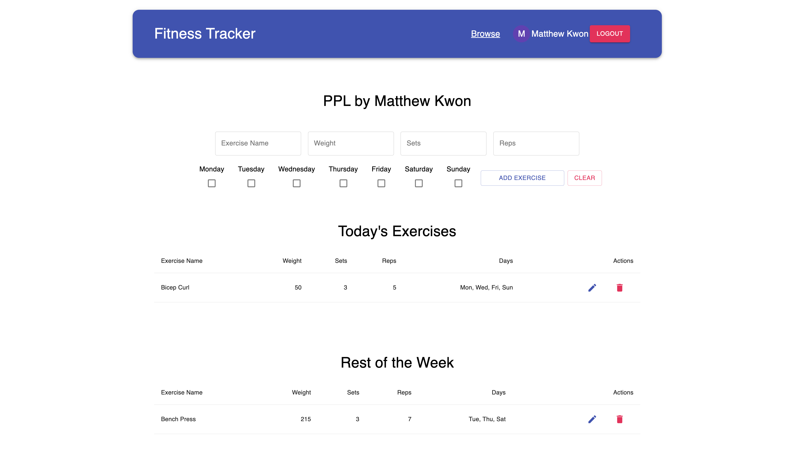

# Fitness Tracker

[Demo](https://fitnesstrackermkwon.netlify.app/)


### What is FitLog?
  > A web application for gym-goers to create their own personalized workout programs and track their progress.
  > FitLog seeks to provide a platform for clients to easily create their own personalized workout programs, track their progress, and share programs with their friends

### Problem
  > Currently, many people use things like their phone's notes app, Microsoft Excel, Google Sheets to create their workout programs but these solutions are clunky and provide an unfriendly user experience.

### Solution
  > FitLog seeks to simplify the process of curating a workout program and tracking your progress.

### How to run locally
  > To run FitLog locally, fork and clone this repository to your local directory.

### Compile the client
  > ```cd client```
  >
  > ```npm install```
  >
  > ```npm run build-prod```

### Start the server
  > ```cd server```
  >
  > ```npm install```
  >
  > ```npm start```
____

### Scenario: User can create personal workout
#### Features:
- [x] Ability to create workouts
  - [x] Make webpage to "create workouts"
  - [x] Make sure it can update to the database
- [x] Ability to see workouts
___

### Scenario: User has an account
#### Features:
- [x] Ability to login
- [x] Ability to associate workout with user
___

### Scenario: User can share workout
#### Features:
- [ ] Ability to share workouts
___

### Scenario: User can log workouts
#### Features:
- [ ] Ability to add notes
- [ ] Ability to add rate of perceived exertion
- [ ] Ability to log actual weight lifted vs projected weight to lift